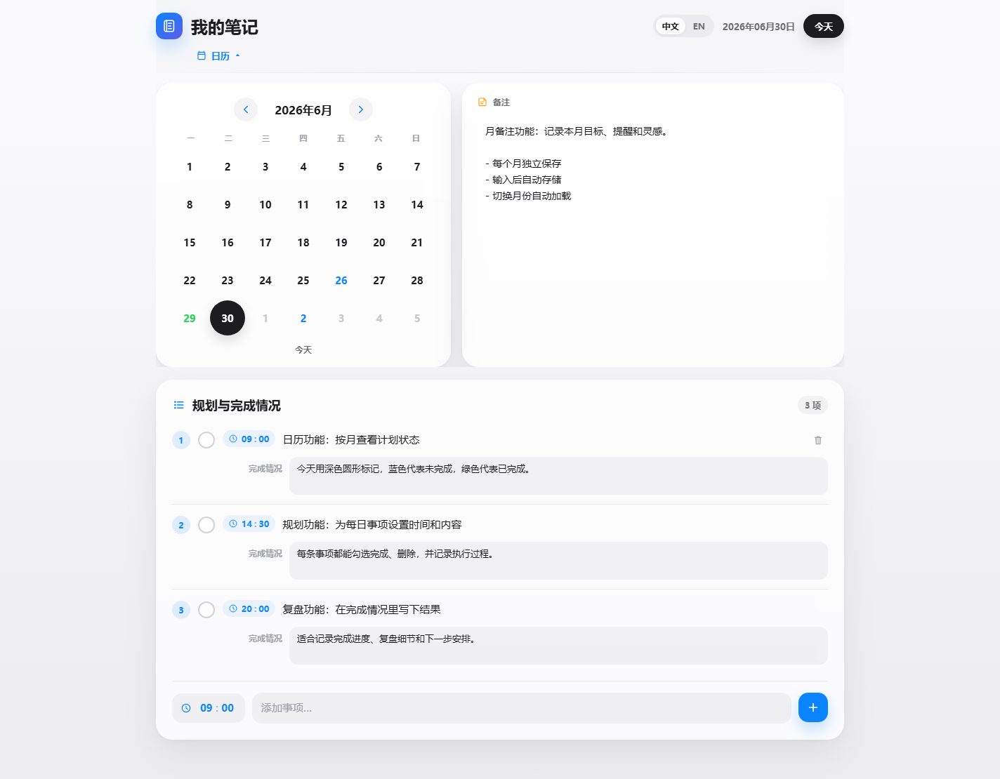
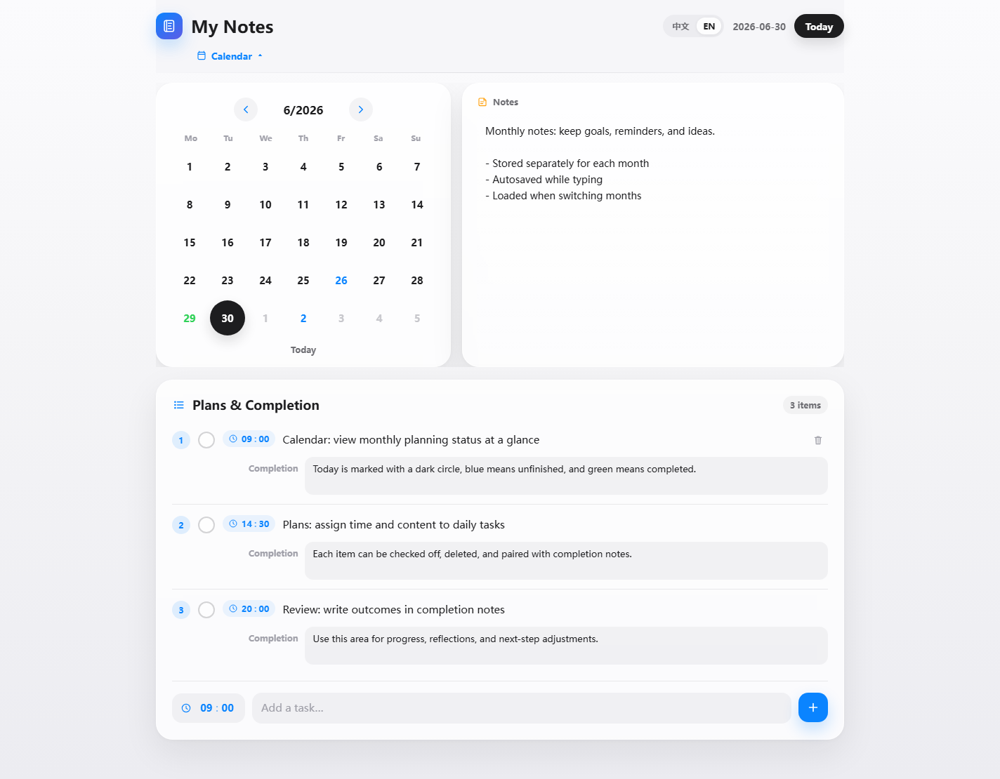
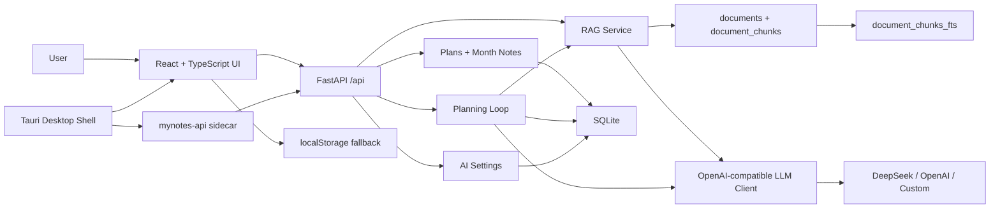

<p align="center">
  <br>
  <strong>MyNotes AI</strong>
  <br>
  <span>AI learning planner, daily review, local RAG, and desktop-ready knowledge assistant.</span>
  <br><br>
  
  
  
  
</p>




## 中文介绍

**MyNotes AI** 是一个面向学习、求职和长期目标管理的 AI 规划系统。它不是简单的日历或聊天框，而是把“目标输入、资料沉淀、AI 规划、日程执行、日报复盘、重排预览、资料问答”连成一个完整闭环。

当前版本已经升级到强作品集方向：前端使用 React + TypeScript + Vite，后端使用 FastAPI，数据层使用 SQLite，AI 能力支持 DeepSeek / OpenAI-compatible 调用，并保留稳定 mock fallback，所以没有 API key 也能完整演示。项目支持粘贴资料、TXT/MD 文件上传、SQLite FTS5 全文索引、BM25 检索、引用来源展示、目标规划 grounding、六维规划质量评测，以及 Tauri + FastAPI sidecar 桌面化骨架。

## English

**MyNotes AI** is an AI planning and review system for learning, job search, and long-term goal management. It connects goal planning, knowledge grounding, calendar execution, daily review, replan preview, material Q&A, and local evaluation into one portfolio-ready AI application.

The project uses React + TypeScript + Vite on the frontend, FastAPI on the backend, and SQLite as the local data layer. It supports DeepSeek/OpenAI-compatible LLM calls with deterministic mock fallback, so the full workflow remains demoable without an API key. It also prepares a Tauri desktop shell that can later bundle the web app and a FastAPI sidecar.

## Current Stage

| Stage | Status | Result |
| --- | --- | --- |
| Phase 0 | Done | Project audit in `docs/audit.md` |
| Phase 1 | Done | React + TypeScript + Vite frontend in `apps/web` |
| Phase 2 | Done | FastAPI routers, SQLite schema, plans API, month-notes API, tests |
| Phase 3 | Done | AI settings, DeepSeek-first OpenAI-compatible client, model test endpoint |
| Phase 4 | Done | Persistent goal planning, daily reviews, replan preview, apply-to-calendar flow |
| Phase 5 | Done | SQLite FTS5/BM25 RAG, document library, source citations |
| Phase 6 | Done | TXT/MD upload RAG and six-dimension planner evaluation |
| Phase 7 | Done | Tauri desktop shell, FastAPI sidecar packaging entry, build scripts, desktop CI check |
| Phase 8 | Done | Windows installer scripts, sidecar packaging checks, GitHub Release automation |
| Phase 9 | Next | Desktop polish, auto-update, code signing, and portfolio presentation upgrades |

## Features

| Module | What it does |
| --- | --- |
| Calendar planning | Manage daily tasks with time, status, completion notes, AI/manual source |
| Daily review loop | Generate persisted daily reviews and preview tomorrow's replanning |
| Replan apply | AI suggestions never mutate data until the user confirms |
| Knowledge base | Save pasted JD, notes, interview materials, or project context |
| File RAG upload | Upload `.txt` and `.md` materials into the same FTS5 knowledge base |
| FTS5/BM25 RAG | Chunk local materials, search with SQLite FTS5, rank with BM25 |
| Source citations | Return document title, chunk, score, and chunk index for every answer |
| Goal grounding | Goal planning can retrieve relevant knowledge-base chunks before generation |
| Model settings | Configure provider, base URL, model, API key, temperature, and timeout |
| Mock fallback | All AI workflows remain demoable without a paid API key |
| Evaluation | Score planning quality across six fixed dimensions |
| Desktop scaffold | Prepare Tauri window, sidecar backend strategy, packaging scripts, and CI checks |

## Tech Stack

| Layer | Stack |
| --- | --- |
| Frontend | React 18, TypeScript, Vite, lucide-react |
| Backend | Python, FastAPI, Pydantic, httpx |
| Database | SQLite, FTS5 virtual table, BM25 ranking |
| AI workflow | Planner Agent, Planning Loop, RAG, Memory, Eval, DeepSeek/OpenAI-compatible client |
| Desktop | Tauri v2 scaffold, FastAPI sidecar strategy, PyInstaller spec |
| Quality | Pytest, Vitest, ESLint, TypeScript build, GitHub Actions |

## Architecture



More details:

- [Architecture](docs/architecture.md)
- [Desktop Packaging Notes](docs/desktop.md)

## Run Locally

Start the backend:

```bash
python -m venv .venv
.\.venv\Scripts\activate
pip install -r requirements.txt
uvicorn backend.app.main:app --reload
```

Start the frontend:

```bash
cd apps/web
npm install
npm run dev
```

Open:

```text
http://127.0.0.1:5173/MyNotes.html
```

## Desktop Preparation

Phase 8 provides the Windows release pipeline. A machine with Node.js, Python, PyInstaller, Rust/Cargo, and the Tauri CLI can build the installer locally, while GitHub Actions can publish release assets from a `v*` tag.

```powershell
.\scripts\check-packaging-toolchain.ps1
.\scripts\build-web.ps1
.\scripts\build-backend.ps1
cd apps\desktop
npm install
npm run build
```

Build the full release package:

```powershell
.\scripts\build-release.ps1 -Version 1.1.0
```

The expected release assets are:

```text
release/MyNotes-AI-v1.1.0-windows-x64.msi
release/MyNotes-AI-v1.1.0-windows-x64.sha256
```

The release design is:

```text
Tauri window -> MyNotes.html -> mynotes-api sidecar -> FastAPI -> SQLite user data directory
```

Desktop environment variables:

| Variable | Purpose |
| --- | --- |
| `MYNOTES_ENV=desktop` | Makes the backend resolve SQLite data under the user data directory |
| `MYNOTES_DB_PATH` | Optional database path override |
| `MYNOTES_API_PORT` | Optional API port, default `8000` |

## AI Configuration

Configure the model inside the AI workspace:

```text
Provider: DeepSeek
Base URL: https://api.deepseek.com
Model: deepseek-chat
API Key: your key
```

API keys are accepted by the backend but never returned by `GET /api/ai/settings`. Without a key, the backend returns stable mock results.

Environment variables are also supported:

```bash
AI_PROVIDER=deepseek
AI_API_KEY=
AI_API_BASE=https://api.deepseek.com
AI_MODEL=deepseek-chat
DATABASE_URL=sqlite:///./data/mynotes.db
```

## RAG Workflow

1. Paste a JD, course note, interview note, or project brief into the knowledge base, or upload a `.txt/.md` file.
2. `POST /api/rag/documents` and `POST /api/rag/documents/upload` save metadata into `documents` and chunks into `document_chunks`.
3. Each chunk is inserted into `document_chunks_fts`.
4. `POST /api/rag/query` searches with FTS5, ranks with `bm25()`, and returns `answer`, `sources`, and `keywords`.
5. `POST /api/planning/goal-plan` also retrieves matching sources and shows them as planning references.

## Verify

Backend:

```bash
python -m compileall backend
.\.venv\Scripts\python.exe -m pytest backend/tests
```

Frontend:

```bash
cd apps/web
npx.cmd tsc -b
npm.cmd run lint
npm.cmd run test
npm.cmd run build
```

Desktop scaffold:

```powershell
.\scripts\check-desktop-config.ps1
```

Packaging toolchain:

```powershell
.\scripts\check-packaging-toolchain.ps1
```

Sidecar health check:

```powershell
.\scripts\wait-api-health.ps1 -Url http://127.0.0.1:8000/api/health
```

## API

| Endpoint | Purpose |
| --- | --- |
| `GET /api/health` | Health check |
| `GET /api/plans?date=YYYY-MM-DD` | List plans for one day |
| `POST /api/plans` | Create a plan |
| `PATCH /api/plans/{id}` | Update a plan |
| `DELETE /api/plans/{id}` | Delete a plan |
| `GET /api/month-notes?year=YYYY&month=M` | Read a monthly note |
| `PUT /api/month-notes` | Save a monthly note |
| `GET /api/ai/settings` | Read public model settings without exposing the key |
| `PUT /api/ai/settings` | Save provider, model, base URL, key, temperature, and timeout |
| `POST /api/ai/test` | Test the configured model or mock fallback |
| `POST /api/planning/goal-plan` | Generate and persist a goal plan with optional RAG sources |
| `POST /api/planning/daily-review` | Generate and persist a daily review plus replan preview |
| `GET /api/planning/daily-review?date=YYYY-MM-DD` | Read a saved daily review |
| `POST /api/planning/replan/apply` | Apply preview tasks to the calendar |
| `POST /api/rag/documents` | Save pasted material and build FTS chunks |
| `POST /api/rag/documents/upload` | Upload a TXT/MD file and build FTS chunks |
| `GET /api/rag/documents` | List knowledge-base documents |
| `DELETE /api/rag/documents/{id}` | Delete a document and its chunks |
| `POST /api/rag/ingest` | Legacy ingest endpoint, still supported |
| `POST /api/rag/query` | Query the local knowledge base and return citations |
| `POST /api/agent/plan` | Generate staged planning output |
| `POST /api/agent/review` | Generate daily review suggestions |
| `POST /api/memory/preferences` | Save preferences |
| `POST /api/eval/planner` | Evaluate planner quality across six dimensions |

## Resume Pitch

独立开发 **MyNotes AI** 学习规划系统，基于 React + TypeScript + Vite 构建前端，使用 FastAPI + SQLite 实现本地数据层，支持日程管理、目标拆解、日报复盘、重排预览、资料库问答、文件上传、偏好记忆、模型配置和规划质量评估；实现 DeepSeek-first 的 OpenAI-compatible LLM client，并保留 mock fallback，保证无 API key 时也可完整演示；基于 SQLite FTS5/BM25 构建本地 RAG 检索能力，对粘贴资料和 TXT/MD 文件进行切片、索引、Top-K 召回和引用来源展示，并将检索结果接入目标规划流程；补齐 Tauri 桌面壳、FastAPI sidecar 打包入口、构建脚本和 CI 静态检查，为后续 Windows 安装包发布做准备。

## License

MIT
