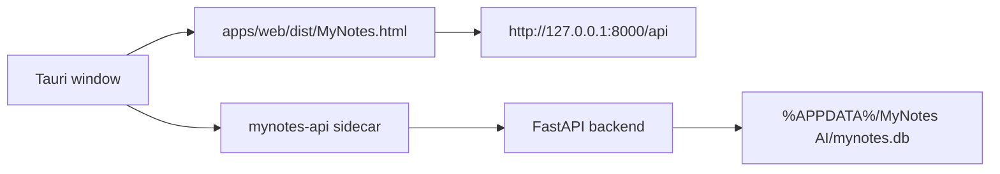

# MyNotes AI Desktop Packaging Notes

Phase 8 turns the desktop scaffold into a Windows installer and GitHub Release pipeline.

## Target Shape



The release app should bundle:

- The built web frontend from `apps/web/dist`
- The backend sidecar binary named `mynotes-api`
- A Tauri window named `MyNotes AI`

## Environment Contract

| Variable | Default | Meaning |
| --- | --- | --- |
| `MYNOTES_ENV` | unset | Set to `desktop` for packaged desktop mode |
| `MYNOTES_API_PORT` | `8000` | Port used by the FastAPI sidecar |
| `MYNOTES_DB_PATH` | unset | Optional explicit SQLite path |

When `MYNOTES_ENV=desktop`, the backend resolves SQLite to:

```text
%APPDATA%\MyNotes AI\mynotes.db
```

If `MYNOTES_DB_PATH` is set, it wins over the desktop default.

## Required Toolchain

Install these before attempting a real local installer build:

1. Node.js 20+
2. Python 3.11+
3. Rust and Cargo from rustup
4. Microsoft Visual Studio Build Tools with C++ desktop workload
5. Tauri CLI through `apps/desktop/package.json`
6. PyInstaller from `requirements-build.txt`
7. Microsoft Edge WebView2 Runtime

Check the local packaging toolchain:

```powershell
.\scripts\check-packaging-toolchain.ps1
```

## Development Mode

```powershell
.\scripts\dev-desktop.ps1
cd apps\desktop
npm install
npm run dev
```

Development mode loads:

```text
http://127.0.0.1:5173/MyNotes.html
```

The web app can still run without Tauri:

```powershell
uvicorn backend.app.main:app --reload
cd apps\web
npm run dev
```

## Build Preparation

Build the web app:

```powershell
.\scripts\build-web.ps1
```

Build the backend sidecar:

```powershell
.\scripts\build-backend.ps1
```

The backend script installs `requirements.txt` and `requirements-build.txt`, then packages `mynotes-api.exe` with PyInstaller. The sidecar copied into Tauri must be named:

```text
apps/desktop/src-tauri/binaries/mynotes-api-x86_64-pc-windows-msvc.exe
```

Poll the sidecar health endpoint:

```powershell
.\scripts\wait-api-health.ps1 -Url http://127.0.0.1:8000/api/health
```

Run the static desktop check:

```powershell
.\scripts\check-desktop-config.ps1
```

## Build The Release Package

```powershell
.\scripts\build-release.ps1 -Version 1.1.0
```

Expected outputs:

```text
release/MyNotes-AI-v1.1.0-windows-x64.msi
release/MyNotes-AI-v1.1.0-windows-x64.sha256
```

Publish locally with the official GitHub CLI after the build succeeds:

```powershell
gh.exe auth status
.\scripts\build-release.ps1 -Version 1.1.0 -CreateGitHubRelease
```

The project also includes `.github/workflows/desktop-release.yml`. Pushing a `v*` tag or manually running the workflow builds the Windows installer and uploads the MSI plus SHA256 checksum to GitHub Release.

## Manual Acceptance

- Install `MyNotes-AI-v1.1.0-windows-x64.msi`.
- Open `MyNotes AI`.
- Confirm the web UI loads.
- Confirm the FastAPI sidecar responds on `/api/health`.
- Try calendar, goal planning, RAG query, TXT/MD material flow, and planner evaluation.
- Close the app and confirm the `mynotes-api` sidecar process exits.

## Common Failures

| Symptom | Fix |
| --- | --- |
| `cargo` or `rustc` missing | Install Rust with rustup and reopen the terminal |
| `PyInstaller` missing | Run `.\.venv\Scripts\python.exe -m pip install -r requirements-build.txt` |
| `tauri` missing | Run `cd apps\desktop; npm.cmd install` |
| `gh.ps1` blocked | Use official `gh.exe`, or publish through GitHub Actions |
| MSI missing | Check `apps/desktop/src-tauri/target/release/bundle/msi` and rerun `npm.cmd run build` |

## Phase 9 Checklist

- Add code signing for Windows releases.
- Add Tauri auto-update.
- Add desktop-specific empty/loading/error states.
- Add release screenshots and a portfolio demo section.
